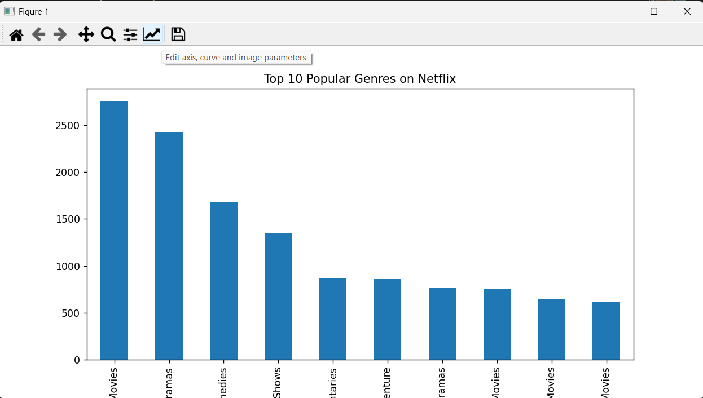
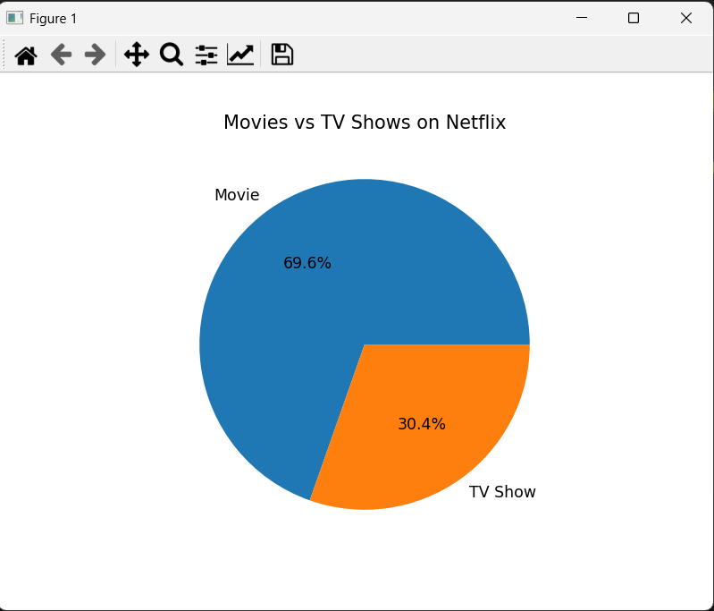
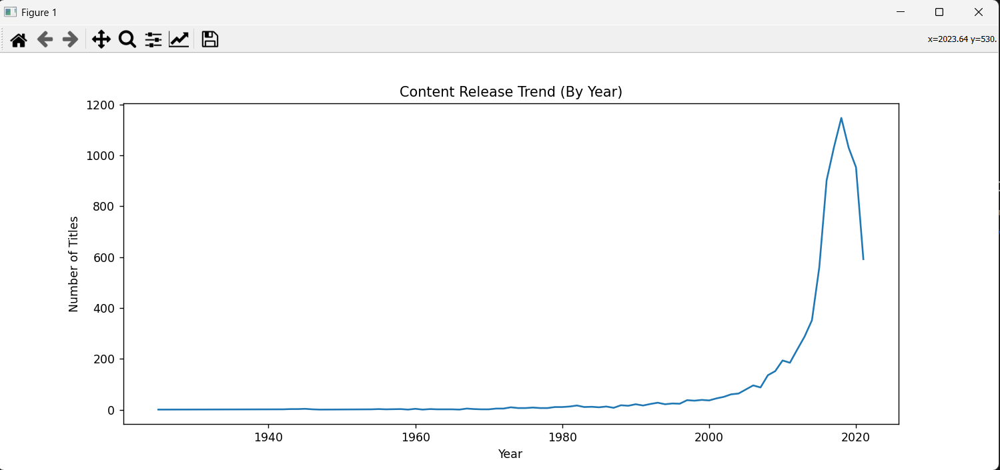

# Netflix-Data-Analysis
Netflix Data Analysis

A complete analysis of Netflix’s Movies and TV Shows dataset to identify trends, content distribution, and genre popularity.

✔ Key Objectives

Clean and preprocess Netflix dataset

Extract insights about movie vs series distribution

Analyze release trends

Identify most common genres

Explore country-wise content production

Build visuals (Python + Power BI)

🛠 Tech Used

Python (Pandas, Matplotlib, Seaborn)

Jupyter Notebook

🔍 Features & Insights

Top 10 most popular genres

Movies vs TV shows distribution

Yearly release trends

Country-wise top content contributors

Dashboard for filtering content by genre, type, and year

📸 Output Screenshots

